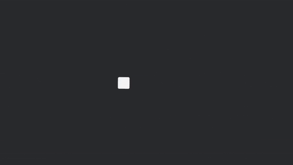

# Bevy Vello Renderer
A minimal integration for rendering [Vello](https://github.com/linebender/vello) graphics in [Bevy](https://bevyengine.org/).

## How it works?

Bevy Vello Renderer is basically a custom render pipeline for rendering Vello `Scene`s onto a texture which is then picked up by the Bevy camera.

## License

The `bevy_vello_renderer` is dual-licensed under either:

- MIT License ([LICENSE-MIT](LICENSE-MIT) or [http://opensource.org/licenses/MIT](http://opensource.org/licenses/MIT))
- Apache License, Version 2.0 ([LICENSE-APACHE](LICENSE-APACHE) or [http://www.apache.org/licenses/LICENSE-2.0](http://www.apache.org/licenses/LICENSE-2.0))

This means you can select the license you prefer!
This dual-licensing approach is the de-facto standard in the Rust ecosystem and there are [very good reasons](https://github.com/bevyengine/bevy/issues/2373) to include both.

## Reference

This project took alot of inspiration and reference from the [bevy_vello](https://github.com/loopystudios/bevy_vello) project. If you want a more featured integration (which includes SVG & Lottie support), do check it out!
